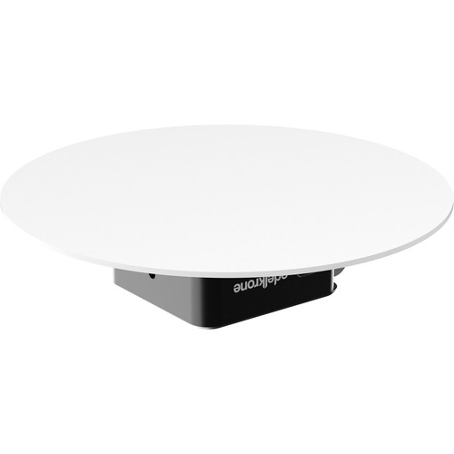
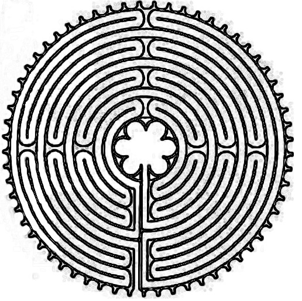
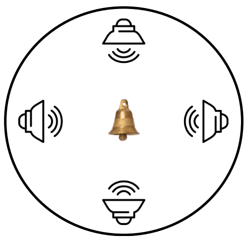
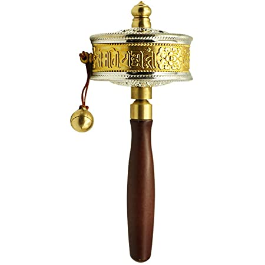

# DXARTS 470 Final Work Proposal

Some title ideas:

- Pascal's Automata 
- Autohierophant
- Interfaith interface
- Do androids transubstantiate an electric eucharist? 

## Background

My intention with this work is to explore the relationship between religious practice, robotics, and artificial intelligence by devising an autonomous sculpture that will enact spiritual practices from a variety of religious traditions using generative visual, audio, and text art. I hope to strike a balance between an initial impression of ironic decontextualization of (very human) spiritual practices performed by a machine with a deeply sincere exploration of the boundaries between forms of life and the philosophical and mystical implications of artificial intelligence directed at transcendental questions. 

The work is inspired by several sources and avenues in my own thought:

- Arthur C. Clarke's seminal 1953 short story "The Nine Billion Names of God"[^1]in which early computer engineers construct a machine to automate a buddhist monasteries practice of exhaustively listing every possible combination of letters in a mystical alphabet that they believe will accurately state the name of God. This work will take a similar shape.
- The real application of robotic agents in actually existing religious communities, a phenomenon that is accelerating due to COVID, and aging populations without access to clergy.[^2]
- The notion of automation or mathematical encoding that is present in many mystical religious traditions, especially the so called "Bible Code" popular in Jewish Kabbalah practice. [^3] 
- The increasingly mystical ideas popular within the tech industry relating to the singularity, simulation hypothesis, and technology. I am deeply suspicious of these trends and want to "enact" some elements of these ideas as a way of thinking through their contradictions. [^4] 
- Thardo Khorlo, or "Electric Dharma Wheels", motorized Tibetan Prayer wheels whose rotation can be considered an automatic application of prayer [^5]
- Sufi "whirling" practice (most famously by the so called "whirling dervishes") where extended performances of receptive motion evoke a translate state and can be considered a form of abstracted, simplified prayer.[^6] 

## Design

The sculpture will consist of three rotating disks. I would ideally want to stack them but they may need to be arranged side-by-side depending on the practical needs of the mechanism. The disks could potentially be made from repurposed turntables or product display devices[^7]. The juxtaposition of three is important for a variety of numerological and theological reasons: they represent three spiritual paths (the lower, middle, and upper), three levels of consciousness, "three wise men", the "three wise monkeys", three religious perspectives: monotheism, polytheism, and buddhism, etc. Each turntable will generate religious artifacts at regular intervals. 

### Disk 1 - Labyrinth Generator

This disk will be mounted with a small pen-plotter device that will be tracing generative artwork onto sheets of circular paper mounted to the disk. The artwork will follow the pattern of "labyrinth" designs, especially labyrinths popular in medieval cathedrals (most notably Chartres). The labyrinths will be generated by custom code written in processing and will include random generative variations based on seed integers from the Torah interpreted numerologically (where each letter represents an integer). Each labyrinth will represent one possible "mapping" of meaning onto segments of the old testament. 

### Disk 2 - Sacred Words & Music

This disk will consist of an array of speakers positioned at the edge of the disk facing inward. The speakers will cycle through variations combining recordings of the reading of religious texts, the performance of religious music, and ambient soundscapes at various frequencies. Each combination of elements will be generated randomly so the device will continually generate novel combinations of material. The center of the disk will be a series of small bells or chimes that sit inertly, receiving the audio from the rotating speakers (which will hopefully produce interesting doppler effects for listeners). At the end of each cycle of material the bells are replaced, generating a series of bells that are "imprinted" with the spiritual tones.

 ### Disk 3 - Prayer Generator

This disk will hold a small thermal printer, likely this inexpensive model from Adafruit[^8]. The printer will continuously print lines of generated "prayers", or algorithmically produced spiritual poetry. I am still developing this algorithm but my intent is to use a combination of simple markov-chain based text generation algorithm with a corpus drawing from religious text and poetry with some sort of internet-based data that pulls keywords from google trends to make the "prayers" continually relevant to news events. The printer will take a data source (a news story pulled form its trends algorithm) and print the religious text followed by a QR code with a link to the original story. As the receipt paper prints it will be coiled around a small replica prayer wheel at the center of the platform. 

## Display/Performance

The sculpture will continually generate discreet "artifacts" (pages with drawn labyrinths, bells encoded with sound, receipt printer prayer). The artifacts will be generated on a fixed schedule (once every 30 minutes, for instance), and I envision them displayed as part of a durational performance where after each cycle I remove the artifacts and display them on the walls of the space: hanging the labyrinth drawings and the bells on string, and pasting each circle of receipt paper on cylinders near the sculpture. Audiences viewing the piece will also see a continuously growing output of "machine religious art" produced by the sculpture.

## Technical Needs

The algorithms powering the three elements will be too complex to run on Arduino alone, so the machines will operate either via Raspberry Pi controllers or one central computer controller sending data to Arduinos powering the pen plotter, speakers, and printer. The pen plotter is the most complex piece of machinery and I may explore a few commercially available options[^9] 

The algorithms needed to power the generative pieces will be complex bits of code. The algorithm interpreting religious numerology and drawing labyrinths will be implemented in processing, a framework I am very comfortable with. The sound pieces will likely be generated in Puredata. The text algorithm will likely be implemented in python using NLP libraries. 

## Aesthetic Considerations

I want the sculpture and surrounding performance to have a simple, minimalist aesthetic that draws elements from both a laboratory clean room a monastic cell. Wiring should be exposed to emphasize the computer origin of the work, but should be coiled with exceptional care and reverence. The performance should be silent and diligent like the work of a monk or nun. 

## Challenges

This is a big project! All three elements are core to my ultimate concept, but as I work on this I may need to scale back and produce only one in a final form in anticipation of finishing the whole piece and performance in future coursework. I would like to have a strong working prototype of all elements of the piece even if the full construction is not finished. 

I am also somewhat concerned about causing offense by working with material that is so sensitive and comes from a variety of cultural traditions. All the theological elements in the piece are based on practices I am deeply familiar with but they will be involved in a semi-ironic decontextualization that may be seen as blasphemous or disrespectful. As the piece develops I want to proceed with due caution and consideration, and may want to speak with religious practitioners from relevant traditions to provide some element of sensitivity reading to the piece, especially the performance component. 

[^1]: [https://en.wikipedia.org/wiki/The_Nine_Billion_Names_of_God](https://en.wikipedia.org/wiki/The_Nine_Billion_Names_of_God)
[^2]: ["Robot priests can bless you, advise you, and even perform your funeral", by Sigal Samuel, vox.com 1/13/2020](https://www.vox.com/future-perfect/2019/9/9/20851753/ai-religion-robot-priest-mindar-buddhism-christianity)
[^3]: [This is exmplified well by this clip by Darren Aranofsky's 1998 film "Pi"](https://www.youtube.com/watch?v=3vi7043z6tI) 
[^4]: ["Tech Billionaires Want to Destroy the Universe" by Sam Kriss, The Atlantic, 10/13/2016](https://www.theatlantic.com/technology/archive/2016/10/silicon-valley-is-obsessed-with-a-false-notion-of-reality/503963/)
[^5]: [https://en.wikipedia.org/wiki/Prayer_wheel#Electric_dharma_wheels](https://en.wikipedia.org/wiki/Prayer_wheel#Electric_dharma_wheels)
[^6]: ["Sufi Whirling Dervishes", PBS, 12/13/2013](https://www.pbs.org/wnet/religionandethics/2013/12/13/february-1-2013-sufi-whirling-dervishes/14517/)
[^7]: [One Potential product, if building the platforms is infeasible](https://www.bhphotovideo.com/c/product/1446505-REG/edelkrone_82061_product_turntable_for_tilt.html/?ap=y&ap=y&smp=y&smp=y&lsft=BI%3A514&gclid=CjwKCAjwgISIBhBfEiwALE19SWZKrN1CyZXbBEZNr71RAUjOVPmIO_thos5l56MNJuBRqaB5OGqN6xoCqEQQAvD_BwE) 
[^8]: [Adafruit thermal printer](https://www.adafruit.com/category/205) 

[^9]: [These plotters from AxiDraw are likely good options](https://axidraw.com)
